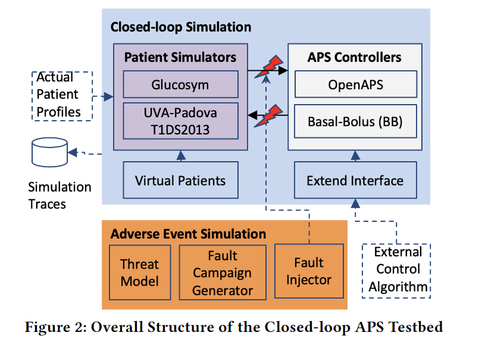
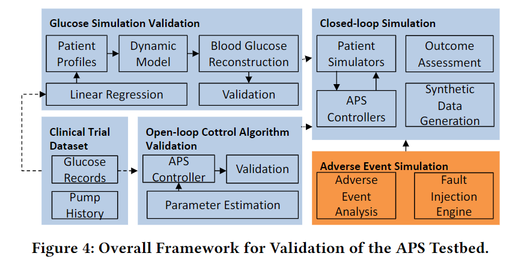
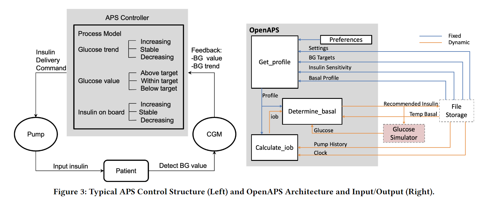

# APS_TestBed
This repository contains a closed-loop testbed for the artificial pancreas system (APS) that evaluates the effectiveness of new control algorithms and other features for the APS in both normal and hazardous environments. The testbed is made up of two APS simulators, UVA/Padova ([1](https://www.ncbi.nlm.nih.gov/pmc/articles/PMC4454102/)) and Glucosym ([2](https://github.com/Perceptus/GlucoSym)), and a fault injection engine. This repository also includes a dataset we generated with the testbed containing both safe and hazardous data traces from APS.

    

## **Main Contributions**

In this work, we designed a closed-loop testbed that combines state-of-the-art APS simulators with a novel fault injection engine. We then developed frameworks for validating that (1) the APS simulators can reasonably reproduce BG traces from clinical trials given the same insulin inputs, initial conditions, and a sufficient number of patient parameters, (2) the control algorithm can generate similar insulin doses to insulin pumps used in clinical trials, and (3) the control algorithm can maintain BG in a safe region more effectively than the basic insulin pump software. The framework for (1) also includes a method for reverse-engineering estimates for patient parameters that are not recorded in clinical trial datasets but are used in the simulators. These validation frameworks can be used to test future simulators and control algorithms. We also provide **25 years** of simulated data for 20 different diabetic patients with different types of adverse events.

The diagram below shows the basic breakdown of the validation framework.

    

### **Patient Profile Estimation**

Part of our paper was validating whether the APS testbed would yield similar results to real patient data. A publicly-available international diabetes closed-loop trial dataset known as [DCLP3](https://www.nejm.org/doi/full/10.1056/NEJMoa1907863) recorded six-months of time-stamped BG readings, insulin doses, and other relevant data from clinical trials with 168 patients. We randomly chose five patients' data (each six-month long) from the DCLP3 dataset\
and compared their BG trajectories during the clinical trial with the simulated BG traces generated using the same insulin inputs from the clinical records at each time step of the simulation.

A major challenge for comparing the simulated traces to the real world traces was recreating the patient profiles for the DCLP patients. The patient profiles consist of the parameters used in the simulators' patient models that determine how the next BG value is calculated, and only a few of these parameters are recorded in the DCLP dataset. To estimate the values of profile parameters we did not have from the dataset, we inferred values using known metabolic models if such models existed and applied linear regression when they did not.

For an example of the first case, the insulin sensitivity factor (AKA correlation factor, CF) is used by the Basal-Bolus controller to calculate a bolus dose, but is not present in the DCLP dataset. However, as mentioned [here](https://www.ncbi.nlm.nih.gov/pmc/articles/PMC4454102/), this factor can be calculated as 1700/TDD, where TDD is the total daily dose of insulin that is commonly estimated as 0.55*BW (for kg) or 0.25*BW (for lbs) and BW is body weight, which is recorded for each patient. This can be done for a few other patient parameters as well, such as insulin to carbs ratio.

After determining as many patient parameters as possible either directly from the DCLP dataset or inferred from metabolic models, we used linear regression to generate an initial estimate of the remaining unknown patient parameters. Both simulators have a bank of existing virtual patients, so for each unknown parameter we constructed a linear model based on the parameters we knew using the virtual patient data. Because the quality of this estimate varies, we made manual changes to the parameters and used the first 10 days of data to evaluate the effectiveness of each change.

## **Testbed Information**

The APS consists of the following 4 main components that are handled slightly differently in each testbed.

1.  CGM Sensor

2.  APS Controller

3.  Insulin Pump

4.  Patient Model

### **UVA/Padova Simulator**

This version of the UVA/Padova simulator is based on a Python-implementation with the Gym API.

1.  *CGM Sensor:* located in simglucose/sensor, this is a simple object that gets the true BG value from the patient model and adds noise to it to calculate a realistic sensor reading

2.  *APS Controller:* located in simglucose/controller, this object receives a observation consisting of sensor readings (i.e. BG) and carbohydrates ingested (if applicable) and must calculate an insulin dose (can be broken into basal and bolus components if desired)

    - Note: Basal-Bolus and PID example controllers are present

3.  *Insulin Pump:* located in simglucose/actuator, this object receives basal and bolus doses from the controller, converts them to the appropriate units and trims them to match the range and accuracy of a realistic insulin pump

    - Note: if you don't want to split doses between basal and bolus, pick one and set the other to 0

4.  *Patient model:* located in simglucose/patient, this object handles the update to all the patient parameters following an insulin dose and carbohydrates ingested (if applicable)

    - The patient model in this version of the simulator has 12 state variables and many more constant parameters unique to each patient. Patient parameters can be found and changed in simglucose/params/vpatient_params.csv

An example simulation step starts with the controller receiving an observation from the environment (which queries the CGM sensor) and calculating a new insulin dose (action) based on its policy (algorithm). This is then fed back into the environment (to the pump and then patient model), leading to updates to the patient model. The next step can then take place by making a new observation from the environment.

In our paper, we use a Basal-Bolus controller for the UVA/Padova simulator.

### **Glucosym Simulator**

This version of the Glucosym simulator is built with node.js and the express framework as a web application with a full UI. Rather than just running as a Python program like UVA/Padova, it is hosted on your local server at localhost:3000. Once the server is running, the patient parameters can be set with in the index endpoint, and the simulation can be started by running one of the files in glucosym/closed_loop_algorithm_samples.

1.  *CGM Sensor* is not explicitly implemented - BG is directly read from the server's response

2.  *APS Controller:* located in glucosym/closed_loop_algorithm_samples, the program makes a post request to server for the new BG value, calculates the next insulin dose base on this value, makes a new post, and so on

    - Variables of the controller, such a P, I, and D, are maintained locally in the file, but are not part of a particular class

    - Carbohydrate events are specified before runtime and are sent in the post request

3.  *Insulin Pump* is not explicitly implemented - the insulin dose is read directly from the controller's post request

4.  *Patient Model:* located in glucosym/routes/index.js, the patient model is updated following a post request from the controller program

    - Patient model parameters are in a object maintained locally on the server

An example simulation step starts with the control program running in glucosym/closed_loop_algorithm_samples making a post request to the /dose endpoint with a insulin and a carbohydrate event. The server updates the patient model with the carbohydrates ingested (if applicable) and the insulin dose, and returns the new BG value in the response. The control program then receives this new BG value and uses it to calculate a new insulin dose.

In our paper, we use the PID-based OpenAPS controller for the Glucosym simulator.

    

### **Fault Injection Engine**

The fault injection engine perturbs the APS controller to simulate both accidental faults or malicious attacks. Once initiated, these faults/attacks manifest themselves as errors in the control software inputs, outputs, and state variables of the control software and can lead the APS into hazardous scenarios like hyper- and hypoglycemia. The fault injection engine directly perturbs the values of the controller's state variables within the acceptable range over a period to simulate the effect of such errors. We assume errors are transient and only occur once for a particular duration per simulation.

The faults that we simulate follow 4 general types shown below based on faults reported to FDA (which collects reports of adverse events and other problems in medical devices).

| Type      | Approach | Simulated Scenario     |
| :---       |    :----   |    :---      |
| Truncate     | Change output variables to zero value       | Availability attack   |
| Hold   | Stop refreshing selected input/output variables        | DoS attack      |
| Max/Min | Change the value of targeted variables to their maximum or minimum allowed values | Integrity attack, memory fault |
| Add/Sub | Add or subtract an arbitrary or particular value to a targeted variable | Integrity attack, memory fault |

More information about the fault injection engine can be found [here](https://arxiv.org/pdf/2104.02545.pdf).

## **How to Cite:** 
X. Zhou, H. Ren, M. Kouzel, H. Alemzadeh, “Design and Validation of an Open-Source Closed-Loop Testbed for Artificial Pancreas Systems,” in the IEEE/ACM Conf. on Connected Health: Applications, Systems and Engineering Technologies (CHASE), 2022. [Online Available](https://arxiv.org/abs/2208.06479)
